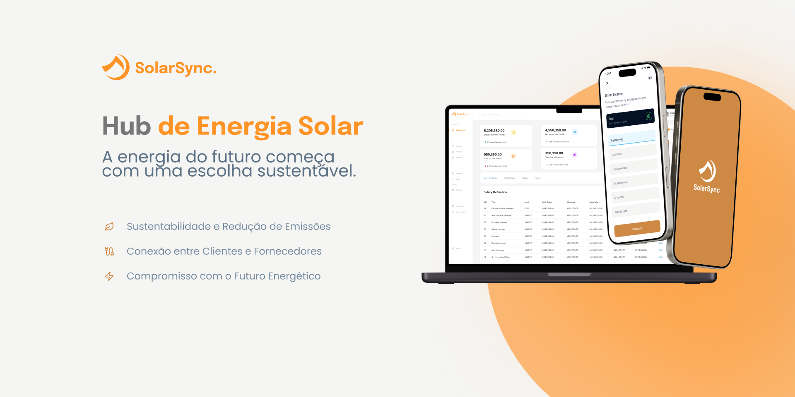

# 🌞 SolarSync: Conectando Pessoas à Energia do Futuro

**Bem-vindo ao GitHub da SolarSync!** Somos uma plataforma intermediadora que conecta clientes e fornecedores de soluções em energia solar, promovendo a sustentabilidade e o acesso à energia limpa. Nosso objetivo é simplificar o processo de escolha, instalação e manutenção de sistemas solares, facilitando a transição para uma matriz energética mais verde e eficiente.

## O que oferecemos:
- Conexão direta entre clientes e fornecedores de energia solar.
- Ferramentas de monitoramento e otimização de sistemas solares.
- Soluções financeiras acessíveis para tornar a energia solar uma realidade para mais pessoas.

Com a SolarSync, acreditamos que o futuro da energia é sustentável, acessível e conectado. Junte-se a nós nesta jornada rumo a um planeta mais sustentável! 🌍✨
